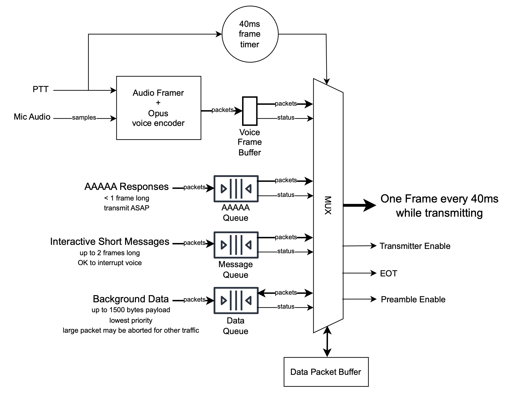

# Transmit Multiplexing for Opulent Voice

This document discusses aspects of a design for an interactive user terminal using the Opulent Voice uplink. It is based on the current (April 2024) 4FSK design embodied in the code found in the `opv-cxx-demod` repository. It is not intended to be part of the air interface standard or to impose any compatibility requirements, though it does make some assumptions about what is required, permitted, or prohibited by the air interface.

## Basics of the Opulent Voice Uplink

Opulent Voice is optimized for 16kbps Opus-encoded digital voice over IP/UDP/RDP, such that one 40ms Opus voice packet perfectly fills one 40ms transmission frame over the air. Voice transmissions are carried over IP, so any other IP packets are easily carried in the same way, without any mode switching.

IP packets are framed using Consistent Overhead Byte Stuffing (COBS), so packets of varying length may be sent without ambiguity. Packets may be shorter than a frame or longer than a frame. The payload portions of contiguous frames are concatenated to form a byte stream, with packet boundaries within the byte stream delineated by COBS encoding.

Voice packets could be allowed to begin in the middle of a transmission frame and end in the middle of the next frame. It is TBD whether the air interface permits that to happen. When voice packets are not aligned with frame boundaries, a single lost frame results in the loss of two consecutive voice packets. This may be sufficient reason to force all voice packets to be aligned within single frames. For now, we will assume that it is.

The baseline system design for Opulent Voice is that of the Haifuraiya (High Flyer) microwave satellite system uplink. In that system, single-channel FDMA uplinks from many ground station user terminals are received by the satellite, demodulated, and multiplexed onto a single DVB-S2/S2X downlink. Each uplink frame carries the transmitting station's callsign and an authentication token, which allows the satellite to control system access. The protocol for secure access control is described in [Phase 4 Air Interface for User Authentication and Authorization](https://github.com/openresearchinstitute/documents/blob/master/Engineering/AAAAA/Protocol%20Description.md). It requires messages to be exchanged between the satellite and the ground station. These messages are short IP/UDP packets.

## Assumptions About the Interactive User Terminal

This design is aimed at the transmit (uplink) side of a full-featured user terminal intended to be used interactively by a human operator. The intention is that this design could also be used for an unattended station or a data-only application.

We assume that the user terminal is a voice-first transceiver using Opulent Voice on its transmit side. As such, it would be equipped with a microphone and an associated push-to-talk switch. It would normally operate in an intermittent mode, with the transmitter enabled only when PTT is activated or data is to be transmitted. The transmitter would automatically shut off at other times, after a brief delay. The duration of the delay might vary. For instance, a Haifuraiya terminal, operating in full duplex, might use a rather long delay to avoid the overhead of setting up the channel again. On the other hand, a peer-to-peer terrestrial Opulent Voice system might operate in a half duplex mode, in which case a minimum delay would be essential to allow comfortable PTT-style conversational voice operation.

We assume that the terminal may include other features that enable data transmissions. Some of these might be more delay-sensitive than others. For instance, there might be a text chat associated with a voice conversation, which would require prompt delivery. There might also be some background telemetry to send, or bulk files to be transferred, any of which might not be time-critical at all.

The terminal probably has receive capability as well as transmit, but here we are interested mainly in the transmit side. The receiver has no choice but to process (or not) what was transmitted to it.

The PTT signal need not be literally the output of a button pressed by the user. For example, it could be a voice activated switch (VOX) that begins the transmission when speech is detected. It could also be a combination, so that the PTT signal is only activated when speech is detected after the button is pressed. There is room here for experimentation to find the most agreeable methods of generating PTT.

## Categories of Uplink Traffic

When multiplexing traffic onto a single transmitter, it is useful to divide the traffic up into categories, so that each category of traffic may be handled appropriately. We tentatively identify the following categories:

### Voice Traffic
Voice traffic is available to transmit whenever the PTT signal is asserted. The Opus encoder generates one packet of voice data for every frame time. It is important that the latency be low and consistent, for listener comfort. Ideally, voice traffic would have absolute priority on the channel, so that every single voice packet would be delivered with minimum latency.

### AAAAA Traffic
In a system like Haifuraiya, there is a need for occasional messages to pass between the ground station and the satellite in support of system access, user authentication, and user authorization (three of the five A's in AAAAA). By design, these messages are less than one frame long. Since the satellite needs information from the ground station in order to decide whether to permit its traffic to continue to pass, we will need to allow the AAAAA packets to go through immediately, even if it means overriding a voice packet. One isolated missing voice packet won't be too noticeable to the listener.

### Interactive Short Message Traffic
A text chat side channel can be a very useful addition to a voice conversation, especially a multi-way conference. A typical typed line of text will fit into one or two frames. Longer chat messages are less common. It's probably most common for chat messages to be typed when the user is not actively speaking, in which case there is no conflict between the message traffic and voice traffic at the transmitter. If the user does manage to type a chat message while speaking, it may be important that the chat message arrive promptly in sequence with the voice. We choose a policy that allows chat messages to override voice packets (but not AAAAA traffic). The user has control over this; they can choose when to hit Enter to transmit a message, so they can choose to leave a gap in their speech so that the chat message can go through without damaging the audio.

### Background Data
The remaining category includes any other data communication function, such as telemetry or bulk file transfer. We have to assume that speed of delivery is not critical for these functions, because the channel is not a particularly fast one. We don't have any extra bandwidth to support sending background data simultaneously with full quality voice data, either. Theoretically we could reduce the voice data rate to allow some background data to pass, but this is supposed to be a high-quality voice system first and foremost. So, we will treat the background data packets as the lowest priority.

For maximum interoperability with other network data systems, we will allow background packets to contain up to 1500 bytes of payload, as Ethernet does. A packet that long will take around a half a second to transmit. If the user activates PTT for a new voice transmission during such a long packet, we can't wait for the background packet to end before beginning the voice transmission. Instead, we must abort the background packet as soon as possible and allow the voice transmission to proceed. COBS framing lets us do this. We will save the aborted packet and try again to send it after the voice transmission is over.

## Managing Frame Timing

The Opulent Voice system design does not include any global timing for frame boundaries, because that would add an unpredictable amount of latency up to an entire frame to every voice transmission. The user terminal is expected to establish uplink frame boundaries on its own. Whenever a PTT activation or availability of another category of traffic causes the transmitter to turn on, a new frame boundary is established and a preamble is transmitted. Frame boundaries must then occur regularly at 40ms spacing until the EOT signal is transmitted and the transmitter is turned off.

If a PTT activation occurs when the transmitter is already on and transmitting another category of traffic, the voice traffic must adapt to the existing frame timing. There is no need for a preamble in this case, so latency is not necessarily worse.

The multiplexing software must run in advance of the actual transmitted frame bounday, so that it has time to decide what traffic will go into that frame and create the frame, and be done with sufficient time to spare for encoding, interleaving, modulation, etc. The simplest way to handle this is to set up a periodic 40ms timer interrupt that occurs early enough in the defined frame. The multiplexer would run after the interrupt. Then, when the frame is ready to deliver to the hardware for transmission, it would wait until the established frame boundary arrives before beginning to send it. The duration of this wait would vary depending on how long the multiplexer took to run. The timing of the interrupt should be adjusted to minimize that duration without danger of underrun.

## Block Diagram

This diagram shows the general architecture of an implementation of the multiplexer. Not all connections are shown.

At the top is the 40ms frame timer, which generates the interrupt that starts the multiplexer working on the next frame. The PTT signal is shown as an input to the frame timer, since in the common case PTT establishes the frame timing, as discussed in the previous section. Not shown in the diagram is the control path that starts the frame timer when non-voice data becomes available with the transmitter off.

Below that we see PTT and audio samples arriving at the audio framer and Opus voice encoder. Every 40ms during a voice transmission this block generates exactly one voice packet, which goes into the single voice frame buffer. This needs to be completed before the frame timer interrupt is processed. Unless the multiplexer decides to allow a data packet to override voice packets, it will see that a voice packet is in the buffer (that's shown as `status` in the drawing) and simply copy the voice packet into the outgoing frame.

Below the audio path we see three parallel structures, one for each category of data packet. Data packets generated by their respective sources are added to the corresponding FIFO queue. The queue provides `status` to the multiplexer, indicating that a packet is available. The multiplexer's job is to analyze the status signals and decide what category of data goes into the next outgoing frame.

Below the multiplexer block the diagram shows a data packet buffer. This buffer is used to store a complete copy of the packet currently being transmitted, along with information about how much of it has already been sent. If a data packet spanning multiple frames has already been partially sent, the multiplexer will usually decide to send the next frame of that packet. It may also decide to abort transmission of that packet in order to make way for voice traffic. If the packet is aborted, the multiplexer pushes a copy of it from the data packet buffer back onto the data queue for a later attempt.

Since the multiplexer is in charge of transmission timing, it is also responsible for deciding when to turn on the transmitter, when to send a preamble, and when to send an EOT signal and turn off the transmitter. These outputs are shown on the right.

## Timing Diagrams

(yet to be drawn!) (or maybe not)

* voice transmission (overview)
* start of voice transmission (detail)
* end of voice transmission (detail)
* AAAAA message during idle
* AAAAA message during voice
* two very short AAAAA messages during voice
* two frame-length AAAAA messages during voice
* chat message during idle
* chat message during voice
* chat message during AAAAA message during idle
* chat message during AAAAA message during voice
* chat message during idle allowed to finish before voice
* background data packets during idle
* background data packet interrupted by voice
* background data packet allowed to finish before voice

## Frame Timer Logic

The frame timer remains idle until one of the four status signals is activated:
* voice packet buffer
* AAAAA message queue
* chat message queue
* data packet queue

If the voice packet buffer status is activated first, the frame timer is started with an initial state TBD ms before its expiration. This delay is chosen to be larger than the maximum variation in the processing time in the Opus vocoder block. This guarantees that future voice packets will always arrive before the timer expiration.

If any other status is activated first, the frame timer is started to expire immediately.

Once started, the frame timer runs continuously, generating an interrupt every 40ms, until an EOT is sent. After the EOT is transmitted, the frame timer returns to the idle state.

If possible, the state of the frame timer is periodically checked against the state of the transmitting hardware and/or the audio sample clock. If drift is detected, the frame timer may be adjusted to compensate. If the audio sample clock is drifting against the transmitting hardware, audio samples may be added or deleted to compensate.

## Multiplexer Logic

The multiplexer keeps some internal state. It manages the data packet buffer, where a non-voice packet being transmitted is stored, along with the index of the next byte of that packet to be transmitted, and which queue originated the packet. In addition, the multiplexer itself runs a state machine with the following states:

| State       | Description                                                   |
|-------------|---------------------------------------------------------------|
| IDLE        | the transmitter is off.                                       |
| PREAMBLE    | a preamble is being transmitted.                              |
| SENDVOICE   | voice data is being transmitted.                              |
| INTERRUPTUS | voice data is being discarded in favor of AAAAA or chat data. |
| SENDDATA    | non-voice data is being sent while voice is idle.             |
| HANGTIME    | filler frames are being sent.                                 |
| SENDEOT     | end-of-transmission signal is being sent.                     |

### Description of Each State
The multiplexer processes each timer interrupt in two phases: first, it performs a state change if one is called for. Second, it builds an output frame or other output, as called for in the (possibly new) state.

The state transitions described below are to be evaluated in the order described; each transition rule after the first one assumes that none of the preceding rules was satisfied.

#### IDLE State
In the IDLE state, the multiplexer does nothing. It is not being activated by a timer interrupt. The transmitter is off. This state can last an unlimited length of time. The state ends when there is something available to transmit.

The function that adds a packet to the voice frame buffer or any of the queues also notifies the frame timer to start. The first interrupt from the frame timer triggers the transition out of the IDLE state. Because a transmission always starts with a preamble, this transition is to the PREAMBLE state.

#### PREAMBLE State
In the PREAMBLE state, the multiplexer instructs the transmitter to generate a frame of preamble.

On the very next frame interrupt, the state transitions out of PREAMBLE and into one of SENDVOICE, INTERRUPTUS, or SENDDATA state, depending on what type(s) of traffic are now available to send. If there is only voice traffic, it transitions to SENDVOICE. If there is only non-voice traffic, it transitions to SENDDATA. In the edge case where voice traffic and AAAAA or chat traffic have arrived simultaneously (i.e., on the same interrupt), the new state is INTERRUPTUS.

#### SENDVOICE State
In the SENDVOICE state, the multiplexer fills frames with voice packets from the voice frame buffer.

A transition out of SENDVOICE state can occur when the voice frame buffer is empty (because of the end of PTT). If there is data in the data queue, the transition is to SENDDATA. Otherwise, the transition is to HANGTIME.

A transition out of SENDVOICE state can also occur when there is data in either the AAAAA queue or the chat queue, in which case the new state is INTERRUPTUS.

#### INTERRUPTUS State

In the INTERRUPTUS state, the multiplexer places AAAAA packets and/or chat packets, in that order of priority, into the frame, while simultaneously accepting and discarding voice packets from the voice frame buffer.

A transition out of INTERRUPTUS state can occur when the voice frame buffer is empty (because of the end of PTT). If there is data in any of the three non-voice queues, or unsent data in the Data Packet Buffer, the transition is to SENDDATA. Otherwise, the transition is to HANGTIME.

A transition out of INTERRUPTUS state can also occur when there is no data in the AAAAA or chat queues and also no unsent datea in the Data Packet Buffer, but there is a voice packet in the voice frame buffer. In this case, the transition is to SENDVOICE.

#### SENDDATA State
In the SENDDATA state, the multiplexer places AAAAA packets and/or chat packets and/or background data packets, in that order of priority, into the frame.

A transition out of SENDDATA state can occur when a voice packet is available in the voice frame buffer. If there is data in the AAAAA queue or the chat queue, or if there is unsent data in the Data Packet Buffer that originated in the AAAAA queue (impossible) or the chat queue, the new state is INTERRUPTUS. Otherwise, the new state is SENDVOICE. If there is unsent data in the Data Packet Buffer that originated in the background data queue, the packet in the Data Packet Buffer is pushed back onto the background data queue for later transmission.

A transition out of SENDDATA state can also occur when the voice frame buffer and all of the data queues are empty. In that case, the transition is to HANGTIME.

#### HANGTIME State
In the HANGTIME state, the multiplexer fills the frame with a filler packet, and decrements the hangtime frame counter.

A transition out of HANGTIME state can occur when a voice packet is available in the voice frame buffer. If there is also data in the AAAAA queue and/or the chat queue, the transition is to INTERRUPTUS. Otherwise, the transition is to SENDVOICE.

A transition out of HANGTIME state can also occur when data is available in any of the non-voice queues. In that case, the transition is to SENDDATA.

A transition out of HANGTIME state can also occur when the hangtime frame counter reaches zero. In that case, the transition is to SENDEOT.

#### SENDEOT State
In the SENDEOT state, the multiplexer instructs the transmitter to generate an EOT signal and stop transmitting thereafter. It then disables the frame timer. The state then immediately transitions to IDLE (without waiting for the frame timer).
